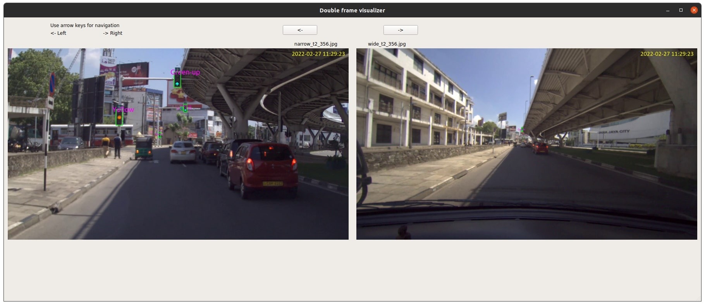

# DualCam Traffic Light Dataset

### Training set annotations compiled in a video

[](https://www.youtube.com/watch?v=-MDhaj5U6ag)

### Visualizer provided for viewing synchronized image pairs in the test set



## Overview
DualCam dataset is a benchmark traffic light dataset which covers urban and sub-urban areas. It consists of 1845 images of 1920x1080 resolution with 5639 instances.

## Download
The train set, test set 1, test set 2, test videos of DualCam traffic light dataset can be downloaded from following google drive links.

* [Train set](https://github.com/harinduravin/DualCam)   - images 1032 (xx GB)
* [Test set 1](https://github.com/harinduravin/DualCam)  - image pairs 335 (xx GB)
* [Test set 2](https://github.com/harinduravin/DualCam)  - image pairs 478 (xx GB)
* [Test videos](https://github.com/harinduravin/DualCam) - xx videos (xx GB)

## Annotations
The annotations are given in  PASCAL VOC XML and YOLO annotation format.

## Statistics

| Traffic light class  | Train set | Test set | Total |
| -------------------- | --------- | -------- | ----- |
| Green (d)            | 1198      | 437      | 1635  |
| Empty-count-down (j) | 537       | 135      | 672   |
| Yellow (b)           | 452       | 138      | 590   |
| Red (a)              | 565       | 384      | 949   |
| Empty (h)            | 222       | 131      | 353   |
| Count-down (i)       | 346       | 146      | 492   |
| Green-up (f)         | 426       | 205      | 631   |
| Red-yellow (c)       | 66        | 25       | 91    |
| Green-left (e)       | 55        | 27       | 82    |
| Green-right (g)      | 115       | 29       | 144   |


## Image Visualizers
We provide 2 visualizers to visualize images with the bounding boxes.

<details open>
<summary>Install</summary>
Clone repo and install [requirements.txt](https://github.com/harinduravin/DualCam.git) in a [Python>=3.7.0](https://www.python.org/) environment

```bash
git clone https://github.com/harinduravin/DualCam.git #clone
cd DualCam
pip install -r requirements.txt  # install
```
</details>

To visualize image use following scripts.

* single-frame visualizer to visualize images with bounding boxes.

```bash
python3 single_image_visualizer.py
```

* dual-frame visualizer to visualize image pairs in test set with bounding boxes.

```bash
python3 sync_image_visualizer.py
```