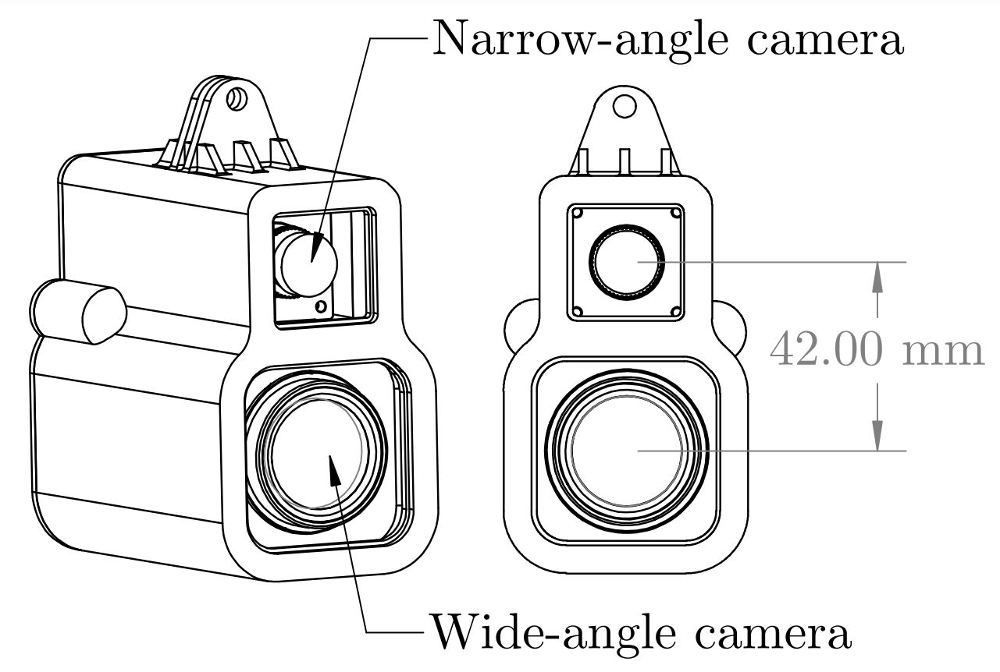

# DualCam Traffic Light Dataset

### A video compilation of training set ground truth

<!-- [](https://www.youtube.com/watch?v=60hbxs4fvB4) -->
<p align="center" width="100%">
    <a href="https://www.youtube.com/watch?v=60hbxs4fvB4" target="_blank"></a>
</p>

## Overview
DualCam dataset is a benchmark traffic light dataset which covers urban and sub-urban areas. It consists of 2250 annotated images of 1920x1080 resolution with 8321 instances.

## Download
The train set, test set 1, test set 2, test videos of DualCam traffic light dataset can be downloaded from following google drive links.

* [Samples](https://github.com/harinduravin/DualCam) - 10 image pairs (xx MB)
* [Train set](https://github.com/harinduravin/DualCam) - 1032 images (xx MB)
* [Test set 1](https://drive.google.com/file/d/1q3bCvudmE19KBqS4k_h1aXPyicjZ400C/view?usp=sharing) - 335 image pairs (547 MB)
* [Test set 2](https://github.com/harinduravin/DualCam) - 478 image pairs (xx MB)
* [Test videos](https://drive.google.com/drive/folders/1n4uyKBaxd0f2EvCdUgiOuMjaTbZh4FpO?usp=sharing) - 28 video pairs (3.63 GB)

## Annotations
The annotations are given in  PASCAL VOC XML and YOLO annotation format.

## Statistics

| Traffic light class  | Train set | Test set | Total |
| -------------------- | --------- | -------- | ----- |
| Green                | 1198      | 1251     | 2449  |
| Red                  | 565       | 901      | 1466  |
| Green-up             | 426       | 495      | 921   |
| Empty-count-down     | 537       | 225      | 762   |
| Count-down           | 346       | 396      | 742   |
| Yellow               | 452       | 246      | 698   |
| Empty                | 222       | 469      | 691   |
| Green-right          | 115       | 171      | 286   |
| Green-left           | 55        | 105      | 160   |
| Red-yellow           | 66        | 80       | 146   |

## Dataset folder structure 

```bash
.
├── samples
│   ├── images
│   ├── xml
│   └── yolo
├── test_1
│   ├── images
│   ├── xml
│   └── yolo
├── test_2
│   ├── images
│   ├── xml
│   └── yolo
├── test_videos
└── train
    ├── images
    ├── xml
    └── yolo
```

## Image Visualizers
We provide 2 visualizers to visualize images with the bounding boxes.

<details open>
<summary>Install</summary>

Clone repo and install [requirements.txt](https://github.com/harinduravin/DualCam.git) in a [Python>=3.7.0](https://www.python.org/) environment

```bash
git clone https://github.com/harinduravin/DualCam.git #clone
cd DualCam
pip install -r requirements.txt  # install
```
</details>

To visualize image use following scripts.

* single-frame visualizer to visualize images with bounding boxes.

```bash
python3 single_image_visualizer.py
```

.. code-block:: python

    from cachesim import CacheSimulator, Cache, MainMemory
    
    mem = MainMemory()
    l3 = Cache("L3", 20480, 16, 64, "LRU")  # 20MB: 20480 sets, 16-ways with cacheline size of 64 bytes
    mem.load_to(l3)
    mem.store_from(l3)
    l2 = Cache("L2", 512, 8, 64, "LRU", store_to=l3, load_from=l3)  # 256KB
    l1 = Cache("L1", 64, 8, 64, "LRU", store_to=l2, load_from=l2)  # 32KB
    cs = CacheSimulator(l1, mem)
    
    cs.load(2342)  # Loads one byte from address 2342, should be a miss in all cache-levels
    cs.store(512, length=8)  # Stores 8 bytes to addresses 512-519,
                             # will also be a load miss (due to write-allocate)
    cs.load(512, length=8)  # Loads from address 512 until (exclusive) 520 (eight bytes)
    
    cs.force_write_back()
    cs.print_stats()

* dual-frame visualizer to visualize image pairs in test set with bounding boxes.

```bash
python3 sync_image_visualizer.py
```

<!--  -->


## Camera details
<p align="center" width="100%">
    
</p>


| Camera | Imaging sensor | Lens | FoV (Vertical) | FoV (Horizontal) | Frame rate (fps) |
| -------|----------------|------| :----:         | :-----: | :---: |
|Narrow-angle camera | Basler <br>daA1920-30uc <br>(S-Mount) | Evetar Lens <br>M13B0618W F1.8 <br>f6mm 1/3” lens | 34.5<sup>0</sup> | 48<sup>0</sup> | 30 |
|Wide-angle camera | Basler <br>daA1920-30uc <br>(CS-Mount) | Theia SY125A/SY125M Lens | 109<sup>0</sup> | 125<sup>0</sup> | 30 |

* [narrow-angle camera data](/camera_data/narrow-angle_camera_data.txt)
* [wide-angle camera data](/camera_data/wide-angle_camera_data.txt)
